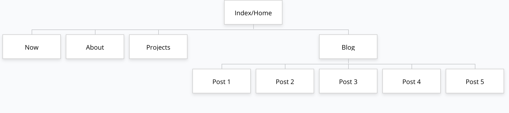
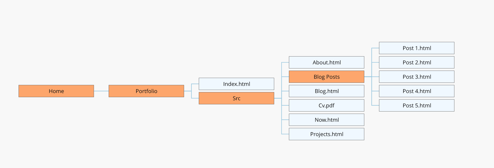

# Santiago Chamon's Personal Portfolio

## Build Status
  Complete - see below for where you can visit the site!

## Website Link
  The site can be found here:
  https://llausa.github.io/portfolio/

  The Rails webapp can be found here:
  https://stormy-citadel-03592.herokuapp.com/

## Github Repo Link
  Here is the link to the repo:
  https://github.com/llausa/portfolio

## Purpose
  The purpose of this website is to showcase my abilities as a Software Developer to potential employers
  and colleagues.

  This website acts as my personal page on the internet and shows who I am to the world so that anyone curious
  to see what I'm about or wants to know who I am or what I have done can quickly find the information digitally.

## Functionality / features
  This is a simple personal portfolio website with 5 html pages and 5 blog posts.

  This site has three main components: 1) the hamburger menu, 2) the index/splash page and 3) the content pages.

  The Index page structure holds the html code for the Index page and the Content page structure holds the html code for all other pages (apart from index.html page).

  The hamburger menu appears on all pages of the site. It is a responsive, pure css solution, that lets users
  navigate between all the different pages in a seamless way. A user visiting the site will be taken to the
  splash/index page where they can then either follow the social icons or click on the hamburger menu.
  The hamburger menu, once clicked, expands and shows the different pages a user can visit.
  The menu expands to encompass the whole screen and lists out all options in a repsonsive way (menu items
  will always be in the middle regardless of screen size of device type).

  The Index/splash (index.html) page has it's own structure and looks different than all other pages. It is the very first page that a User sees when they follow the home link to the website. This page will display my first name and last name, along with some introductory text and social
  icons (linkedin and github in this case).
  This page is responsive so it will have the same structure across different screen sizes and devices with
  with minor changes to font-size and positioning in order to maintain the desired design effect.

  The content page structure holds the html structure for all other pages in the site. The first and last name are located to the top-left hand corner, with content starting on the intersection between both names.
  Social links are also now located underneath the last name across the pages with content.
  Content is very varied in this site. It ranges from a few p tags holding text to a list of articles in the blog to a projects page holding divs of images and text and links inside each div.
  These content pages are also responsive to different devices and screen-sizes and have the same desired design effect as the rest of the website.

## Sitemap
  Sitemap 1
  
  If you would like to read some notes for this sitemap, checkout the interactive sitemap here: https://www.gloomaps.com/MYAK2jhoMw

  Sitemap 2
  

## Design Process (w/Screenshots)
  * Inspiration
    - [Pinterest Website Inspiration Board](https://www.pinterest.com.au/santiagochamon/portfolio-inspiration/)
    - [Alana Company Website](http://alanacompany.com/)
    - [Dave Allie (.) com](https://daveallie.com/)

  * Sketches/Mockups
    - [Index Desktop Sketch](docs/desktop_index_sketch.jpg)
    - [Content Desktop Sketch](docs/desktop_content_sketch.jpg)
    - [Index Mobile Sketch](docs/mobile_sketch.jpg)
    - [Index Desktop Mockup](docs/desktop_mockup_final.png)
    - [Content Desktop Mockup](docs/desktop_content_page_final.png)
    - [Index Mobile Mockup](docs/mobile_mockup_final.png)
    - [Content Mobile Mockup](docs/mobile_content_mockup_final.png)

  * End Result (responsiveness)
    - [Mobile](docs/final_mobile.png)
    - [Laptop](docs/final_laptop.jpg)
    - [Desktop](docs/final_desktop.jpg)

## Target audience
  The target audience for this website will be Employers looking to engage a Software developer for their services. It may also include recruiters, colleagues and others from the Tech Industry, looking to get more insight into the individual whose website this belongs to.

## Tech stack
  This website was created with the following tools:
  * HTML
  * CSS
  * SCSS
  * [Font Awesome](https://fontawesome.com/)
  * [Google Fonts](https://fonts.google.com/)
